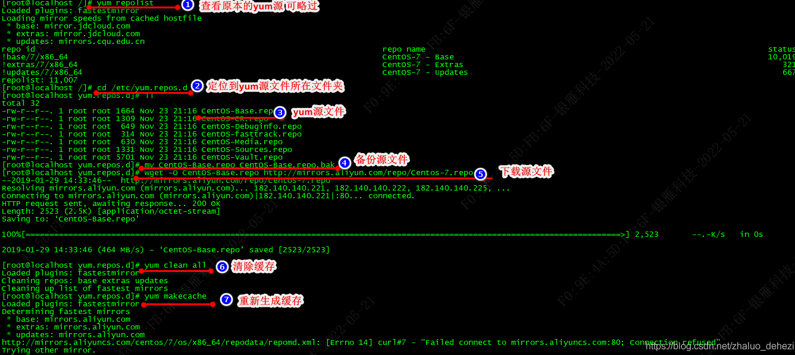
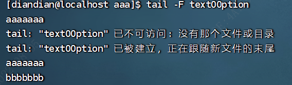
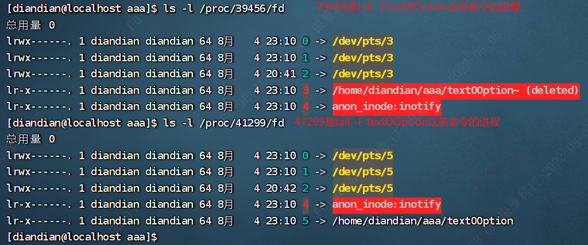

# 日常使用命令

## `find`命令


用法：find [路径] [表达式选项] [行动]

**语法**

```
find   path   -option   [   -print ]   [ -exec   -ok   command ]   {} \;
```

**参数说明** :

find 根据下列规则判断 path 和 expression，在命令列上第一个 - ( ) , ! 之前的部份为 path，之后的是 expression（表达式选项）。如果 path 是空字串则使用目前路径，如果 expression 是空字串则使用 -print 为预设 expression。

**1、常用表达式选项参数说明**
选项	参数说明

```
-mount, -xdev	只检查和指定目录在同一个文件系统下的文件，避免列出其它文件系统中的文件
-amin n	在过去 n 分钟内被读取过
-anewer file	比文件 file 更晚被读取过的文件
-atime n	在过去n天内被读取过的文件
-cmin n	在过去 n 分钟内被修改过
-cnewer file	比文件 file 更新的文件
-ctime n	在过去n天内被修改过的文件
-empty	空的文件-gid n or -group name
-ipath p, -path p	路径名称符合 p 的文件，ipath 会忽略大小写
-name name, -iname name	文件名称符合 name 的文件。iname 会忽略大小写
-size n	文件大小 是 n 单位，b 代表 512 位元组的区块，c 表示字元数，k 表示 kilo bytes，w 是二个位元组。
-type b/d/c/p/l/f	查是块设备、目录、字符设备、管道、符号链接、普通文件
-perm	按执行权限来查找
-user username	按文件属主来查找
-group groupname	按组来查找
-depth	指定查找目录深度
-follow	如果遇到符号链接文件，就跟踪链接所指的文件
-prune	忽略某个目录
-maxdepth	指定查找目录最大深度
-mindepth	指定查找目录最小深度
-version	查看版本
-help	获取帮助
```

**2、常用行动参数说明**
参数	参数说明
-

```
delete	删除查找到的文件
-exec command	对查找到的文件执行command命令
-ok command	执行命令前需要进行确认
-printf	格式化输出
```

**3、多条件组合参数**
参数	参数说明

```
-o	是或者的意思
-a	是而且的意思
-not	是相反的意思
```

## `mail`发送邮件

可参考：https://blog.csdn.net/Jerry00713/article/details/123328521

加密发邮件和不加密发邮件http://t.zoukankan.com/itbox-p-13207227.html

## `gpasswd`组操作

**gpasswd 命令详解**

#### 1、功能：管理组

```
  用法：gpasswd[-a user][-d user][-A user,...][-M user,...][-r][-R]groupname
  参数：
	-a：添加用户到组
	-d：从组删除用户
	-A：指定管理员
	-M：指定组成员和-A的用途差不多
	-r：删除密码
	-R：限制用户登入组，只有组中的成员才可以用newgrp加入该组 
```


#### 2、实例：

问：如何将多个用户加入到指定的组？（usermod -a -G 也能实现这个效果）
前言：usemod -G 改写用户的组之后，用户的组信息是覆盖，也就是说usermod使用户只能存在于一个组。那么如何使用户同时属于多个组呢？ gpasswd -a试试吧

```
[root@localhost ~]# useradd user1
[root@localhost ~]# useradd user2
[root@localhost ~]# useradd user3
[root@localhost ~]# groupadd group1
[root@localhost ~]# gpasswd -a user1 group1
正在将用户“user1”加入到“group1”组中
[root@localhost ~]# gpasswd -a user2 group1
[root@localhost ~]# cat /etc/group
group1:x：1011:user1,user2 
```

问：如何替换某个组的所有成员呢？

```
[root@localhost ~]# gpasswd -M user2,user3 group1
[root@localhost ~]# cat /etc/group
group1:x：1011:user2,user3
```

问：如何删除某个组的某个成员

原组中有三个用户，删除其中一个用户。

```
[root@localhost ~]# grep group1 /etc/group
group1:x：1011:user3,user1,user2
[root@localhost ~]# gpasswd -d user1 group1
正在将用户“user1”从“group1”组中删除
[root@localhost ~]# grep group1 /etc/group
group1:x：1011:user3,user2
```

## `usermod`用户操作

usermod -a -G rootroot mysql

> 参　　数：
>
> 　-c<备注> 　修改用户帐号的备注文字。
> 　-d登入目录> 　修改用户登入时的目录。
> 　-e<有效期限> 　修改帐号的有效期限。
> 　-f<缓冲天数> 　修改在密码过期后多少天即关闭该帐号。
> 　-g<群组> 　修改用户所属的群组。
> 　-G<群组> 　修改用户所属的附加群组。
> 　-l<帐号名称> 　修改用户帐号名称。
> 　-L 　锁定用户密码，使密码无效。
> 　-s(shell 　修改用户登入后所使用的shell。
> 　-u(uid) 　修改用户ID。
> 　-U 　解除密码锁定。
>
>     -a, --append          append the user to the supplemental GROUPS 
>                                 mentioned by the -G option without removing 
>                                 him/her from other groups 

> 将一个用户添加到用户组中，千万不能直接用： 
>
> usermod -G groupA 
>
> 这样做会使你离开其他用户组，仅仅做为 这个用户组 groupA 的成员。 
>
> 应该用 加上 -a 选项： 
>
> usermod -a -G groupA user
>
> (FC4: usermod -G groupA,groupB,groupC user)
>
> -a 代表 append， 也就是 将自己添加到 用户组groupA 中，而不必离开 其他用户组。 

## `less`命令

**less [选项] [FILE]...**

less与more类似，使用less可以随意浏览文件，而more仅能向前移动，不能向后移动，而且 less 在查
看之前不会加载整个文件。
ps -ef | less ps查看进程信息并通过less分页显示
history | less 查看命令历史使用记录并通过less分页显示
选项：

```
-b <缓冲区大小> 设置缓冲区的大小
-g 只标志最后搜索的关键词
-i 忽略搜索时的大小写
-m 显示类似more命令的百分比
-N 显示每行的行号
-o <文件名> 将less 输出的内容在指定文件中保存起来
-Q 不使用警告音
-s 显示连续空行为一行
```

常用交互式命令:

```
/字符串：向下搜索"字符串"的功能
?字符串：向上搜索"字符串"的功能
n：重复前一个搜索（与 / 或 ? 有关）
N：反向重复前一个搜索（与 / 或 ? 有关）
b 向后翻一页
h 显示帮助界面
q 退出less 命令
g, <, ESC-<
	跳转到第 N 行，默认为文件首行。键入前可先输入数值 N，生效一次
	例子：先输入数字 1000g这样就能直接跳珠到1000行了
G, >, ESC->
	跳转到第 N 行，默认为文件末行。键入前可先输入数值 N，生效一次
```


以下描述中，^X 表示 control-X，ESC 表示退出键，比如 ESC-v 表示两个字符序列，先是 ESC，然后是 v。如果忘记命令，可以键入 h 或 H 查看命令的帮助信息。

## `more`命令

> 在网络上的多个博客和菜鸟教程的解释中，都说了more是无法向前移动的，也不能向前移动，但是经过测试centos7的版本使用more命令的时候可以按b进行向前翻页,后来经过查证，是因为后面版本更新了，给more添加了这个功能。但是more仍然是一次性加载完所有日志，less则不会一下子完全加载完日志


#### 1.命令格式：

```
more [-dlfpcsu ] [-num ] [+/ pattern] [+ linenum] [file ... ] 
```

#### 2.命令功能：

2.1 more命令功能类似cat: cat命令是整个文件的内容从上到下显示在屏幕上, more会以一页一页的显示方便使用者逐页阅读
2.2 more可以按页来查看文件的内容，还支持直接跳转行等功能
2.3 按空白键(space)就往下一页显示，按b键就会往回(back)一页显示

#### 3.命令参数：

```
+n  从笫n行开始显示
-n  定义屏幕大小为n行
-c  从顶部清屏，然后显示
-d  提示“Press space to continue，’q’ to quit（按空格键继续，按q键退出）”，禁用响铃功能
-l  略Ctrl+l（换页）字符
-p  通过清除窗口而不是滚屏来对文件进行换页，与-c选项相似
-s  把连续的多个空行显示为一行
-u  把文件内容中的下画线去掉
+/pattern 在每个档案显示前搜寻该字串(pattern)，然后从该字串前两行之后开始显示  
```

#### 4.常用操作命令：

```
Enter    向下n行，需要定义。默认为1行
Ctrl+F   向下滚动一屏
空格键   向下滚动一屏
Ctrl+B   返回上一屏
=        输出当前行的行号
:f       输出文件名和当前行的行号
V        调用vi编辑器
!命令    调用Shell，并执行命令 
q        退出more
```

#### 5.命令实例：

> 1、从第3行起,显示文件中的内容: more +3 文件名
>
> 2、从文件中查找第一个出现"04字符串的行，并从该处前两行开始显示输出: more +/pattern 文件名
>
> 3、设定每屏显示行数：more -n 文件名
>
> 4 、列出一个目录下的文件(由于内容太多，我们应该学会用more来分页显示),这得和管道|结合起来 
> ls -l  | more -5
>
> 每页显示5个文件信息，按 Ctrl+F或者空格键,将会显示下5条文件信息。


## more和less的区别

**more： 顾名思义显示更多**
**less： 由于more不能后退，就取more的反义词less加上后退功能**
**所以Linux里流传着这样一句话："less is more".**


**总结下more 和 less的区别:**
**1.  less可以按键盘上下方向键显示上下内容,more不能通过上下方向键控制显示，但是可以通过ctrl+B返回上一页。**
**2.  less不必读整个文件，加载速度会比more更快**
**3.  less退出后shell不会留下刚显示的内容,而more退出后会在shell上留下刚显示的内容**


## `vi`命令

> https://www.cnblogs.com/aragorn1026/p/7766406.html

vvi命令是UNIX操作系统和类UNIX操作系统中最通用的全屏幕纯文本编辑器。Linux中的vi编辑器叫vim，它是vi的增强版（vi Improved），与vi编辑器完全兼容，而且实现了很多增强功能。

vi命令有两种模式：命令模式和编辑模式。使用“A”、“a”、“O”、“o”、“I”、“i”等命令后即可进入编辑模式，以对文件进行编辑；按ESC键可以从编辑模式切换到命令模式。

> u:撤销   和 
>
> Ctrl + R 重做
>
> ---
>
> x或X：删除一个字符，x删除光标后的，而X删除光标前的；
>
> :$：光标跳转到最后一行的行首；
> x或X：删除一个字符，x删除光标后的，而X删除光标前的；
> D：删除从当前光标到光标所在行尾的全部字符；
> dd：删除光标行正行内容；
>
> p(小写p)：粘贴文本操作，用于将缓存区的内容粘贴到当前光标所在位置的下方；
> P(大写P)：粘贴文本操作，用于将缓存区的内容粘贴到当前光标所在位置的上方；
>
> a：在当前字符后添加文本；
> A：在行末添加文本；
>
> i：在当前字符前插入文本
>
> I：在行首插入文本；
> o(小写o)：在当前行后面插入一空行；
> O(大写O)：在当前行前面插入一空行；
>
> ---
>
> **显示行号**:命令模式下输入“:set number”后按回车，注意前面有冒号，关闭显示行号输入“:set nonumber”回车即可
>
> **跳到指定的行**：命令模式下输入命令“:5”回车，如果要跳转到最后一行行首，输入命令“:$”回车
>
> **删除光标所在的当前行**：命令模式下按“dd”
>
> **删除字符**:命令模式下按“x”可以删除光标后的字符（即光标所在位置处的字符），如左图；按“X”可删除光标前的字符
>
> **查找字符串**:从光标位置向文件尾部查找文本中的“123”字符串，命令模式下输入“/123”回车，搜索出来的结果将会高亮显示，如左图；将光标移动到第六行行首，从光标位置向文件头部查找文本中的“123”字符串，命令模式下输入“?123”回车
>
> **替换文本**：1.将第五行至第14行中的“123”字符串替换为“abc”，在命令模式下输入“:5,14s/123/abc”回车，如下左图（如果在第8行有多个匹配的字符串，只会对此行第一个匹配的结果进行替换）；如果不输入行号范围，则只在本行查找替换（不论光标在本行哪个位置，都从头开始查找，但只会对第一次找到的结果进行替换），如果本行查询不到则不执行任何操作，例如将光标移动到第14行行首，将本行中的“abc”替换为“123”，命令模式下“:s/abc/123”回车。
>
> 2.如果要将某个范围内或者整个文本中的字符串替换为另一个字符串，需要加上"/g"，例如将第12行至第14行中的字符“cc”替换为"11"，输入命令“:12,14s/cc/11/g”回车，效果如下右图；如果不指定行号范围，则只对光标所在行进行全部替换。
>
> 3.替换文本的另外两种情况，输入“:%s/F/T”回车是将整个文本中所有行第一个匹配的F替换为T；输入“:%s/F/T/g”回车是将整个文本中所有的F替换为T。
>
> 4.如果要替换的字符串中含有“/”，则将间隔符换为“#”即可，例如“:s#var/#sky/”是将字符串“var/”替换为“sky/”，其他用法与上面一致。
>
> ---
>
> /字符串：文本查找操作，用于从当前光标所在位置开始向文件尾部查找指定字符串的内容，查找的字符串会被加亮显示；(这里注意下，如果你要继续查找此关键字（也就是假如有很多的关键字的话，想查到当前贯光标位置的下个关键字），敲字符 n 就可以继续查找了。敲字符N（大写N）就会向前查询；)
>
> ---
>
> ？name：文本查找操作，用于从当前光标所在位置开始向文件头部查找指定字符串的内容，查找的字符串会被加亮显示；
>
> ---

编辑模式

## `man`命令

在Linux下，man命令的使用方法为：**man + [要查询的命令]**

,然后进入手册界面，在此界面中，可以使用键盘来控制翻页等操作

| 按键      | 用途                               |
| :-------- | :--------------------------------- |
| 空格键    | 向下翻一页                         |
| PaGe down | 向下翻一页                         |
| PaGe up   | 向上翻一页                         |
| home      | 直接前往首页                       |
| end       | 直接前往尾页                       |
| /         | 从上至下搜索某个关键词，如“/linux” |
| ？        | 从下至上搜索某个关键词，如“?linux” |
| n         | 定位到下一个搜索到的关键词         |
| N         | 定位到上一个搜索到的关键词         |
| q         | 退出帮助文档                       |

如此一来，遇到不知道怎么用的命令时就可以直接使用man命令查询手册了。

## `mv`命令

mv (move) 用来移动或改名文件和目录。

移动文件时如果目标文件已经存，则目标文件的内容将被覆盖。

mv 命令可以用来将源文件移至一个目标文件中，或将一组文件移至一个目标目录中。源文件被移至目标文件有两种不同的结果：

（1）如果目标文件是目录，源文件会被移到此目录下，且文件名不变。当目标文件是目录时，源文件或目录参数可以有多个，则所有的源文件都会被移至目标目录中。所有移到该目录下的文件都将保留以前的文件名。

（2） 如果目标文件不是目录文件，则源文件名（只能有一个）会变为此目标文件名，并覆盖己存在的同名文件。如果源文件和目标文件在同一个目录下，mv 的作用就是改文件名。

```
mv [OPTION]... [-T] SOURCE DEST
mv [OPTION]... SOURCE... DIRECTORY
mv [OPTION]... -t DIRECTORY SOURCE...

选项说明：
--backup=[=CONTROL]
	若需覆盖文件，则覆盖前先行备份
-b
	当文件存在时，覆盖前，为其创建一个备份。功能类似于--backup，但是不需要接收参数
-f, --force
	若目标文件或目录与现有的文件或目录重复，则直接覆盖现有的文件或目录，不进行提示
-i, --interactive
	交互式操作，覆盖前先行询问用户，如果源文件与目标文件或目标目录中的文件同名，则询问用户是否覆盖目标文件。用户输入”y”，表示将覆盖目标文件；输入”n”，表示取消对源文件的移动。这样可以避免误将文件覆盖
-n, --no-clobber
	不覆盖现有的同名文件或目录；如果同时指定多个以下选项，-i, -f, -n，则只有最后一个生效
--strip-trailing-slashes
	删除参数 SOURCE 中所有目录末端的斜杠
-S, --suffix=SUFFIX
	为备份文件指定后缀，而不使用默认的后缀
-t, --target-directory=DIRECTORY
	指定源文件要移动到的目标目录
-u, --update
	当源文件比目标文件新或者目标文件不存在时，才执行移动操作
-v, --verbose
	冗余模式执行 mv，解释 mv 命令的执行过程
--help
	显示帮助信息并退出
--version
	显示版本信息并退出
```

**常用示例**

（1）将文件 old 改名为 new。

```
mv old new
```

（2）将目录 /usr/men 中的所有文件移到当前目录（用.表示）中。

```
mv /usr/men/* .
```

## `su`命令

**语法**

```
su [-fmp] [-c command] [-s shell] [--help] [--version] [-] [USER [ARG]]
```

**参数说明**：

- -f 或 --fast 不必读启动档（如 csh.cshrc 等），仅用于 csh 或 tcsh
- -m -p 或 --preserve-environment 执行 su 时不改变环境变数
- -c command 或 --command=command 变更为帐号为 USER 的使用者并执行指令（command）后再变回原来使用者
- -s shell 或 --shell=shell 指定要执行的 shell （bash csh tcsh 等），预设值为 /etc/passwd 内的该使用者（USER） shell
- --help 显示说明文件
- --version 显示版本资讯
- \- -l 或 --login 这个参数加了之后，就好像是重新 login 为该使用者一样，大部份环境变数（HOME SHELL USER等等）都是以该使用者（USER）为主，并且工作目录也会改变，如果没有指定 USER ，内定是 root
- USER 欲变更的使用者帐号
- ARG 传入新的 shell 参数

**实例**

变更帐号为 root 并在执行 ls 指令后退出变回原使用者

```
su -c ls root
```

变更帐号为 root 并传入 -f 参数给新执行的 shell

```
su root -f
```

**变更帐号为 clsung 并改变工作目录至 clsung 的家目录（home dir）**

```
su - clsung
```

## `cd`命令

Linux cd（英文全拼：change directory）命令用于切换当前工作目录。

其中 dirName 表示法可为绝对路径或相对路径。若目录名称省略，则变换至使用者的 home 目录 (也就是刚 login 时所在的目录)。

另外，

**~** 也表示为 home 目录 的意思， 

**.**  则是表示目前所在的目录，

**..** 则表示目前目录位置的上一层目录。

**-**  则表示前一个工作目录，就是像当前pwd在目录/root/root,这时cd /r/r/r/r/r/r/r/r/r/r,这时候进入到一个很深的目录的时候，想回到上一级的操作目录的时候 可以使用 cd - 命令返回到目录/root/root中

## `touch`命令

> 创建文件和修改文件时间戳

> touch 和 mkdir 之间的区别是什么呢？mkdir命令是创建空目录，touch 是创建空文件

> touch的作用本来不是创建文件，而是将指定文件的修改时间设置为当前时间。
>
> 就是假装“碰”（touch）了一下这个文件，假装文件被“修改”了，于是文件的修改时间就是被设置为当前时间。
>
> 这带来了一个副作用，就是当touch一个不存在的文件的时候，它会创建这个文件。
>
> ```
> 然后，由于touch已经可以完成创建文件的功能了，就不再需要一个单独的create了。
> ```
>
> ---
>
> 对上面的补充：这个命令最早出现在UnixVersion7中，是KenThompson和DennisRichie两位大神写的一个工具。至于为什么叫这个名字，外网上也有很多讨论，但两位当事人并没有回应过。
>
> 如果看下Unix/Linux源码，你会发现touch里有这么一行代码：
>
> open("t",O_WRONLY|O_CREAT|O_NOCTTY|O_NONBLOCK,0666)=3
>
> ```
> 其中的O_CREAT常量就是文件不存在就创建的原因。
> ```

touch 命令不光可以用来创建文件（当指定操作文件不存在时，该命令会在当前位置建立一个空文件），此命令更重要的功能是修改文件的时间参数（但当文件存在时，会修改此文件的时间参数）。

Linux 系统中，每个文件主要拥有 3 个时间参数（通过 **stat 命令进行查看**），分别是**文件的访问时间**、**数据修改时间**以及**状态修改时间**：

- 访问时间（Access Time，简称 atime）：只要文件的内容被读取，访问时间就会更新。例如，使用 **cat 命令可以查看文件的内容**，此时文件的访问时间就会发生改变。
- 数据修改时间（Modify Time，简称 mtime）：当文件的内容数据发生改变，此文件的数据修改时间就会跟着相应改变。
- 状态修改时间（Change Time，简称 ctime）：当文件的状态发生变化，就会相应改变这个时间。比如说，如果文件的权限或者属性发生改变，此时间就会相应改变。

touch 命令的基本格式如下：touch [选项] 文件名

选项：

- -a：只修改文件的访问时间；
- -c：仅修改文件的时间参数（3 个时间参数都改变），如果文件不存在，则不建立新文件。
- -d：后面可以跟欲修订的日期，而不用当前的日期，即把文件的 atime 和 mtime 时间改为指定的时间。
- -m：只修改文件的数据修改时间。
- -t：命令后面可以跟欲修订的时间，而不用目前的时间，时间书写格式为 `YYMMDDhhmm`。

touch 命令可以只修改文件的访问时间，也可以只修改文件的数据修改时间，但是不能只修改文件的状态修改时间。因为，不论是修改访问时间，还是修改文件的数据时间，对文件来讲，状态都会发生改变，即状态修改时间会随之改变（更新为操作当前文件的真正时间）。

## `yum`命令

> YUM(Yellowdog Updater Modified)：是一个基于RPM的软件包管理器，能够从指定服务器自动下载RPM包并且安装，可以处理软件之间的依赖关系，一次性安装所有依赖的软件包，无需一个个下载安装。

### yum的设置文件

配置文件所在目录：`/etc/yum.repos.d`,这个目录的文件扩展名为"*.repo"（只要扩展名为 "*.repo" 的文件都是 yum 源的配置文件）。通常情况下 CentOS-Base.repo 文件生效。

> 查看yum server所使用的容器：yum repolist all
> 删除所有已下载的所有容器相关数据：yum clean all

实际操作可查看https://developer.aliyun.com/mirror/centos?spm=a2c6h.13651102.0.0.57341b11lGkb6w

> 1.centos7对应的镜像（替换yum的源地址，也就是更改从哪个服务器上下载）
>
> ```shell
> wget -O /etc/yum.repos.d/CentOS-Base.repo https://mirrors.aliyun.com/repo/Centos-7.repo
> ```
>
>  2.运行 yum makecache 生成缓存

### 详细命令（个人感觉网易的镜像好用点）

```shell

centos7 修改yum源为阿里源
首先是到yum源设置文件夹里
1. 查看yum源信息:
    yum repolist
2. 定位到base reop源位置
     cd /etc/yum.repos.d
3. 接着备份旧的配置文件
    mv CentOS-Base.repo CentOS-Base.repo.bak
4. 下载阿里源的文件
  wget -O CentOS-Base.repo http://mirrors.aliyun.com/repo/Centos-7.repo
---------------------------红帽版本一样的安装------------------------------
# 安装epel repo源：
epel(RHEL 7) 红帽7
   wget -O /etc/yum.repos.d/epel.repo http://mirrors.aliyun.com/repo/epel-7.repo
epel(RHEL 6) 红帽6
    wget -O /etc/yum.repos.d/epel.repo http://mirrors.aliyun.com/repo/epel-6.repo
epel(RHEL 5) 红帽5
    wget -O /etc/yum.repos.d/epel.repo http://mirrors.aliyun.com/repo/epel-5.repo
------------------------------------------------------------------------------    
5.清理缓存
    yum clean all
6.重新生成缓存
    yum makecache
7. 再次查看yum源信息
   yum repolist
————————————————
from:
https://blog.csdn.net/zhaluo_dehezi/article/details/86689322
```



```shell
yum常用命令
删除软件：yum remove AAA-x.x.x.rpm或者yum erase foo-x.x.x.rpm
升级软件：yum upgrade AAA或者yum update AAA
查询信息：yum info AAA
搜索软件（以包含foo字段为例）：yum search AAA
显示软件包依赖关系：yum deplist AAA
 
　　 -q 静默执行 
　　 -t 忽略错误
　　-R[分钟] 设置等待时间
　　-y 自动应答yes
　　--skip-broken 忽略依赖问题
　　--nogpgcheck 忽略GPG验证
 
　　check-update 检查可更新的包
　　clean all    清除全部[缓存]
　　clean packages 清除临时包文件（/var/cache/yum 下文件）
　　clean headers  清除rpm头文件
　　clean oldheaders 清除旧的rpm头文件
　　deplist 列出包的依赖
　　list 可安装和可更新的RPM包
　　list installed 已安装的包
　　list extras 已安装且不在资源库的包
　　info 可安装和可更新的RPM包 信息
　　info installed 已安装包的信息(-qa 参数相似)
　　install[RPM包] 安装包
　　localinstall 安装本地的 RPM包
　　update[RPM包] 更新包
　　upgrade 升级系统
　　search[关键词] 搜索包
　　provides[关键词] 搜索特定包文件名
　　reinstall[RPM包] 重新安装包
　　repolist 显示资源库的配置
　　resolvedep 指定依赖
　　remove[RPM包] 卸载包
    makecache  生成缓存
```


### 功能

#### 1 、查询

```
# yum search raid    //搜索某个软件名称或者描述的重要关键字
# yum info mdadm     //列出软件功能
# yum list			 //列出yum服务器上面所有的软件名称
# yum list pam*		 //找出以pam开头的软件名称
# yum list updates	 //列出yum服务器上可提供本机进行升级的软件
12345
```

#### 2 、安装/升级

```
# yum install/update 软件名称 
# yum install 软件名称 -y 		//安装过程中免输入y确认
12
```

#### 3、 删除

```
# yum remove 软件名称
1
```

#### 4 、软件组功能

```
# yum grouplist			 			//查看容器和本机上可用与安装过的软件组
# yum groupinfo group_name     		//查看group内所有组名称
# yum install/remove group_name		//安装与删除
123
```

#### 全系统升级

yum -y update 升级所有包，改变软件设置和系统设置,系统版本内核都升级
yum -y upgrade 升级所有包，不改变软件设置和系统设置，系统版本升级，内核不改变
已经上线的用yum -y upgrade 比较稳
全新的用yum -y update 会更好

#### 关于自动更新

想要自动更新，首先得安装的自动更新的软件，首先需要安装 yum-cron 软件包。该软件包提供以 cron 命令运行 yum 更新所需的文件。如果你想要每晚通过 cron 自动更新可以安装这个软件包。如果未安装相应的软件，则yum-cron.conf该文件不存在，还有相应yum-updatesd服务也会响应找不到相应的服务。

```shell
方法一
1.进入yum目录

[root@localhost ~]$ cd /etc/yum

2.编辑yum-cron.conf文件

[root@localhost yum]$ vi yum-cron.conf

3.把download_updates = yes的值改为no，保存更改后即可。

方法二
检查 yum-updatesd 查看

service yum-updatesd stop #启动 yum-updatesd 服务
service yum-updatesd stop #停止 yum-updatesd 服务
service yum-updatesd status #查看状态

chkconfig yum-updatesd off #禁止开机启动，关闭
chkconfig yum-updatesd on #开机启动服务，开启
```

#### yum被锁的解决办法（*）

```
from:https://blog.csdn.net/weixin_34310785/article/details/92876256
今天用yum安装软件时报错：

[root@lvs2 yum.repos.d]# yum -y install ipvsadm
Loaded plugins: rhnplugin, security
This system is not registered with RHN.
RHN support will be disabled.
Existing lock /var/run/yum.pid: another copy is running as pid 11986.
Another app is currently holding the yum lock; waiting for it to exit...
  The other application is: pirut
    Memory :  54 M RSS (103 MB VSZ)
    Started: Fri Jul  2 01:09:33 2010 - 18:52:40 ago
    State  : Sleeping, pid: 11986
 

解决办法如下：

1。rm -rf /var/run/yum.pid

2./etc/init.d/yum-updatesd stop
```


## `uptime`命令（uptime:(计算机等的)运行时间）

**uptime**

```
uptime
```

另外还有一个参数 -V(大写)，是用来查询版本的

procps是一个实用程序包，主要包括ps top kill等程序主要用来显示与控制一些系统信息，进程状态之类的内容。

以下显示输入uptime的信息：

```
04:03:58 up 10 days, 13:19, 1 user, load average: 0.54, 0.40, 0.20
```

1. 当前时间 04:03:58
2. 系统已运行的时间 10 days, 13:19
3. 当前在线用户 1 user(可以理解为用户连接数，是总连接数而不是用户)
4. 平均负载：0.54, 0.40, 0.20，最近1分钟、5分钟、15分钟系统的负载

### cat /proc/loadavg

最直接查看系统平均负载命令

```
root@Slyar.com:~# cat /proc/loadavg
0.10 0.06 0.01 1/72 29632
```

除了前3个数字表示平均进程数量外，后面的1个分数，分母表示系统进程总数，分子表示正在运行的进程数；最后一个数字表示最近运行的进程ID

## `sar`命令（System ActivityReporter系统活动情况报告）

目前Linux上最为全面的系统性能分析工具之一，可以从多方面对系统的活动进行报告，包括：文件的读写情况、系统调用的使用情况、磁盘I/O、CPU效率、内存使用状况、进程活动及IPC有关的活动等

```bsh
用法: sar [ 选项 ] [ <时间间隔> [ <次数> ] ]
选项:
[ -A ] [ -B ] [ -b ] [ -C ] [ -d ] [ -H ] [ -h ] [ -p ] [ -q ] [ -R ]
[ -r ] [ -S ] [ -t ] [ -u [ ALL ] ] [ -V ] [ -v ] [ -W ] [ -w ] [ -y ]
[ -I { <中断> [,...] | SUM | ALL | XALL } ] [ -P { <cpu> [,...] | ALL } ]
[ -m { <关键词> [,...] | ALL } ] [ -n { <关键词> [,...] | ALL } ]
[ -j { ID | LABEL | PATH | UUID | ... } ]
[ -f [ <文件名> ] | -o [ <文件名> ] | -[0-9]+ ]
[ -i <间隔> ] [ -s [ <时:分:秒> ] ] [ -e [ <时:分:秒> ] ]
```

```
-A:所有报告的总和

-b:显示I/O和传递速率的统计信息

-B:显示换页状态

-d:输出每一块磁盘的使用信息

-e:设置显示报告的结束时间

-f:从制定的文件读取报告

-i:设置状态信息刷新的间隔时间

-P:报告每个CPU的状态

-R:显示内存状态

–u:输出cpu使用情况和统计信息

–v:显示索引节点、文件和其他内核表的状态

-w:显示交换分区的状态

-x:显示给定进程的装

-r:报告内存利用率的统计信息
```

#### 使用实例  

1、sar -u  #统计CPU的使用情况，每间隔1秒钟统计一次总共统计三次：#sar -u 1 3

> %user #用户空间的CPU使用
>
> \%nice 改变过优先级的进程的CPU使用率
>
> %system 内核空间的CPU使用率
>
> %iowait CPU等待IO的百分比 
>
> %steal 虚拟机的虚拟机CPU使用的CPU
>
> %idle 空闲的CPU

在以上的显示当中，主要看%iowait和%idle，%iowait过高表示存在I/O瓶颈，即磁盘IO无法满足业务需求，如果%idle过低表示CPU使用率比较严重，需要结合内存使用等情况判断CPU是否瓶颈。 

2、sar -p 1 3 #报个每个CPU的使用状态：

> CPU 所有CPU的统计
>
> %user 用户态的CPU使用统计
>
> %nice 更改过优先级的进程的CPU使用统计
>
> %iowait CPU等待IO数据的百分比
>
> %steal 虚拟机的vCPU占用的物理CPU的百分比
>
> %idle 空闲的CPU百分比

3、将统计结果保存在文件并从文件读取内容：

> sar -u -o /tmp/1.txt 2 3 #保存之文件，保存后的文件是二进制的，无法使用vim和cat直接打开
>
> sar -u -f /tmp/1.txt #从二进制文件读取

4、sar -q #查看平均负载：

> runq-sz  运行队列的长度（等待运行的进程数，每核的CP不能超过3个）
>
> plist-sz 进程列表中的进程（processes）和线程数（threads）的数量
>
> ldavg-1 最后1分钟的CPU平均负载，即将多核CPU过去一分钟的负载相加再除以核心数得出的平均值，5分钟和15分钟以此类推
>
> ldavg-5 最后5分钟的CPU平均负载
>
> ldavg-15 最后15分钟的CPU平均负载

5、sar -d #磁盘使用详情统计

> DEV 磁盘设备的名称，如果不加-p，会显示dev253-0类似的设备名称，因此加上-p显示的名称更直接
>
> tps：每秒I/O的传输总数
>
> rd_sec/s 每秒读取的扇区的总数
>
> wr_sec/s 每秒写入的扇区的 总数
>
> avgrq-sz 平均每次次磁盘I/O操作的数据大小（扇区）
>
> avgqu-sz 磁盘请求队列的平均长度
>
> await 从请求磁盘操作到系统完成处理，每次请求的平均消耗时间，包括请求队列等待时间，单位是毫秒（1秒等于1000毫秒），等于寻道时间+队列时间+服务时间
>
> svctm I/O的服务处理时间，即不包括请求队列中的时间
>
> %util I/O请求占用的CPU百分比，值越高，说明I/O越慢

6、sar -v #进程、inode、文件和锁表状态

> dentunusd 在缓冲目录条目中没有使用的条目数量
>
> file-nr 被系统使用的文件句柄数量
>
> inode-nr 已经使用的索引数量 
>
> pty-nr 使用的pty数量

## `tar`命令

tar在Linux上是常用的打包、压缩、加压缩工具，他的参数很多，折里仅仅列举常用的压缩与解压缩参数

```
参数：
-c ：create 建立压缩档案的参数；
-x ： 解压缩压缩档案的参数；
-z ： 是否需要用gzip压缩或解压（带了这个参数则代表使用gzip，不带的话就是代表不使用gzip）；
-v： 压缩的过程中显示档案（带了这个参数的话会将压缩或者解压的详细情况打印在控制台中）；
-f： 置顶文档名，在f后面立即接文件名，不能再加参数
```

## `head`命令

```shell
head [参数] [文件]  
```

**参数：**

- -q 隐藏文件名

- -v 显示文件名
  
  - -c<数目> 显示的字节数。
  - -n<行数> 显示的行数。
  
  **实例**
  

要显示 runoob_notes.log 文件的开头 10 行，请输入以下命令：

  ```shell
  head runoob_notes.log
  ```

显示 notes.log 文件的开头 5 行，请输入以下命令：

  ```shell
  head -n 5 runoob_notes.log
  ```

## `tail`命令

**tail -f filename** 会把 filename 文件里的最尾部的内容显示在屏幕上，并且不断刷新，只要 filename 更新就可以看到最新的文件内容。

**命令格式：**

```
tail [参数] [文件]  
```

**参数：**

- -f 循环读取（经过实测有些情况，-f并不能实时更新文本内容，要使用 tail -F 命令才能够实时更新文本内容，下面对这种情况进行解读）

  > tail -f   等同于--follow=descriptor，**根据文件描述符进行追踪，当文件改名或被删除，追踪停止**
  >
  > tail -F   等同于--follow=name  --retry，**根据文件名进行追踪，并保持重试，即该文件被删除或改名后，如果再次创建相同的文件名，会继续追踪**
  >
  > 如果采用vi xxx这种方式编辑文本的话，执行该tail -f textOOption命令的话，内容一直不会改变，并且不实时刷新文本内容。
  >
  > 
  >
  > 
  >
  > 通过查看进程对应的文本描述符的话会发现
  >
  > 
  >
  > vi命令编辑的文本相当于先删除创建了，所以tail -f 并不能够实时显示vi编辑后的文本，只有tail -F才能够实时显示vi编辑后的文本

- -q 不显示处理信息

- -v 显示详细的处理信息

- -c<数目> 显示的字节数
  - -n<行数> 显示文件的尾部 n 行内容
  - --pid=PID 与-f合用,表示在进程ID,PID死掉之后结束
  - -q, --quiet, --silent 从不输出给出文件名的首部
  
- -s, --sleep-interval=S 与-f合用,表示在每次反复的间隔休眠S秒
  

**实例**

  要显示 notes.log 文件的最后 10 行，请输入以下命令：

  ```
  tail notes.log         # 默认显示最后 10 行
  ```

要跟踪名为 notes.log 的文件的增长情况，请输入以下命令：

```
  tail -f notes.log
```

此命令显示 notes.log 文件的最后 10 行。当将某些行添加至 notes.log 文件时，tail 命令会继续显示这些行。 显示一直继续，直到您按下（Ctrl-C）组合键停止显示。

显示文件 notes.log 的内容，从第 20 行至文件末尾:

```
  tail -n +20 notes.log
```

显示文件 notes.log 的最后 10 个字符:

```
  tail -c 10 notes.log
```

## 系统监控

### `free`命令

free 命令能够显示系统中物理上的空闲和已用内存，还有交换内存，同时，也能显示被内核使用的缓冲和缓存

> 在Windows操作系统中，每当RAM的内存量不足以容纳一个进程时，RAM都会从辅助存储中借用一些内存。此借用的内存称为虚拟内存。同样，每当RAM在Linux中的内存不足时，它都会从辅助存储借用一些内存来存储其非活动内容。
>
> 这样，RAM会找到足够的空间在其中容纳新进程。在这里，从硬盘借来的空间称为交换内存。在本文中，我们将尝试详细学习交换内存的概念。

> 交换内存的工作：
>
> 如上所述，交换内存是RAM耗尽时将使用的专用硬盘数量。Linux中有一个内存管理程序可以处理此过程。每当RAM内存不足时，内存管理程序都会查找RAM中存在的所有长时间未使用的非活动数据块。
>
> 成功找到这些块后，会将其移入交换存储器。这样，RAM的空间得以释放，因此可以将其用于其他一些需要紧急处理的程序。交换的概念与Windows操作系统中使用的分页的概念非常相似。

```shell
语法：free [param]
```

param可以为：

- -b：以Byte为单位显示内存使用情况；
- -k：以KB为单位显示内存使用情况；
- -m：以MB为单位显示内存使用情况；
- -o：不显示缓冲区调节列；
- -s<间隔秒数>：持续观察内存使用状况；
- -t：显示内存总和列；
- -V：显示版本信息。

> 共享链接库：一些共享的库文件，不需要每个进程都加载进内存中，每个进程可以共享他们。从而达到节省内存的目的。

buff/cache：表示系统的page cachr和buffer使用到的内存

available:表示应用程序还可以申请到的内存

> 对应用程序来说，buff/cache是等于可用的，因为buff/cache是为了提高文件读取的性能的，当应用程序需要用到内存的时候，buff/cache会很快被回收[但是因为一些系统的page/cache是不能被回收的]，所以available<free+buff/cache

系统当前使用到的内存是：usef+buff/cache,used中包含了shared

所以total=used+buff/cache+free

### `ulimit`命令

ulimit用于显示系统资源限制的信息

### `top`命令

```shell
语法：top [param]
```

param为：

-b：以批处理模式操作；这个一般和 -n 一起使用
-c：显示完整的治命令；
-d：屏幕刷新间隔时间；
-I：忽略失效过程；
-s：保密模式；
-S：累积模式；
-u [用户名]：指定用户名；
-p [进程号]：指定进程；
-n [次数]：循环显示的次数。
top命令分为上下两个部分：

系统统计信息
系统进程信息

> >  按“1”键，可打开或关闭显示详细CPU统计信息
>
> >  按字母“B”键，可打开或关闭当前进程的显示效果

应用：

>  top -Hp pid 可以查看某个进程的线程信息(pid为进程号)，此linux命令，其中参数H指展示线程信息，p指代展示对应的哪个进程号。

对top命令输出信息的详解：

Linux下的top命令我相信大家都用过，自从我接触Linux以来就一直用top查看进程的CPU和MEM排行榜。但是top命令的其他输出结果我都没有了解，这些指标都代表什么呢，什么情况下需要关注呢？以及top命令输出结果的来源数据是什么呢，又是怎么一个计算原理呢？

### 演示环境

```
# uname -a
Linux VM_1_11_centos 3.10.0-693.el7.x86_64 #1 SMP Tue Aug 22 21:09:27 UTC 2017 x86_64 x86_64 x86_64 GNU/Linux
```

**top命令**

top命令是Linux下常用的性能分析工具，能够实时（默认是3s刷新一次）的显示系统的资源使用情况，以及各种进程的资源使用情况，类似于Windows的任务管理器。

```
top - 11:00:54 up 54 days, 23:35,  6 users,  load average: 16.32, 18.75, 21.04
Tasks: 209 total,   3 running, 205 sleeping,   0 stopped,   1 zombie
%Cpu(s): 29.7 us, 18.9 sy,  0.0 ni, 49.3 id,  1.7 wa,  0.0 hi,  0.4 si,  0.0 st
KiB Mem : 32781216 total,  1506220 free,  6525496 used, 24749500 buff/cache
KiB Swap:        0 total,        0 free,        0 used. 25607592 avail Mem 

  PID USER      PR  NI    VIRT    RES    SHR S  %CPU %MEM     TIME+ COMMAND                                                                                                                                                                  
23444 root      20   0   15.6g 461676   4704 R 198.0  1.4  11:15.26 python                                                                                                                                                                   
16729 root      20   0 9725596 240028   4672 R 113.0  0.7   7:48.49 python                                                                                                                                                                   
 3388 root      20   0 6878028 143196   4720 S  82.4  0.4   1:35.03 python       
```

第一行数据相当于uptime命令输出。11:00:54是当前时间，up 54 days,23:55 是系统已经运行的时间，6 users表示当前有6个用户在登录，load average：16.32，18.75，21.04分别表示系统一分钟平均负载，5分钟平均负载，15分钟平均负载。

**平均负载**

平均负载表示的平均活跃进程数，包括正在running的进程数，准备running（就绪态）的进程数，和处于不可中断睡眠状态的进程数。如果平均负载数刚好等于CPU核数，那证明每个核都能得到很好的利用，如果平均负载数大于核数证明系统处于过载的状态，通常认为是超过核数的70%认为是严重过载，需要关注。还需结合1分钟平均负载，5分钟平均负载，15分钟平均负载看负载的趋势，如果1分钟负载比较高，5分钟和15分钟的平均负载都比较低，则说明是瞬间升高，需要观察。如果三个值都很高则需要关注下是否某个进程在疯狂消耗CPU或者有频繁的IO操作，也有可能是系统运行的进程太多，频繁的进程切换导致。比如说上面的演示环境是一台8核的centos机器，证明系统是长期处于过载状态在运行。

```
Tasks: 214 total,   4 running, 209 sleeping,   0 stopped,   1 zombie
```

第二行的Tasks信息展示的系统运行的整体进程数量和状态信息。214 total 表示系统现在一共有214个用户进程，4 running 表示4个进程正在处于running状态，209 sleeping表示209个进程正处于sleeping状态，0 stopped 表示 0 个进程正处于stopped状态，1 zombie表示 有1个僵尸进程。

**僵尸进程**

子进程结束时父进程没有调用wait()/waitpid()等待子进程结束，那么就会产生僵尸进程。原因是子进程结束时并没有真正退出，而是留下一个僵尸进程的数据结构在系统进程表中，等待父进程清理，如果父进程已经退出则会由init进程接替父进程进行处理（收尸）。由此可见，如果父进程不作为并且又不退出，就会有大量的僵尸进程，每个僵尸进程会占用进程表的一个位置（slot），如果僵尸进程太多会导致系统无法创建新的进程，因为进程表的容量是有限的。所以当zombie这个指标太大时需要引起我们的注意。下面的进程详细信息中的S列就代表进程的运行状态，Z表示该进程是僵尸进程。

消灭僵尸进程的方法：

1.找到僵尸进程的父进程pid（pstress可以显示进程父子关系），kill -9 pid，父进程退出后init自动会清理僵尸进程。（需要注意的是kill -9并不能杀死僵尸进程）

2.重启系统。

```
%Cpu(s): 31.9 us, 30.3 sy,  0.0 ni, 37.0 id,  0.0 wa,  0.0 hi,  0.8 si,  0.0 st
```

第三行的%Cpu(s)表示的是总体CPU使用情况。

- us user 表示用户态的CPU时间比例
- sy system 表示内核态的CPU时间比例
- ni nice 表示运行低优先级进程的CPU时间比例
- id idle 表示空闲CPU时间比例
- wa iowait 表示处于IO等待的CPU时间比例
- hi hard interrupt 表示处理硬中断的CPU时间比例
- si soft interrupt 表示处理软中断的CPU时间比例
- st steal 表示当前系统运行在虚拟机中的时候，被其他虚拟机占用的CPU时间比例。

所以整体的CPU使用率=1-id。当us很高时，证明CPU时间主要消耗在用户代码，需要优化用户代码。sy很高时，说明CPU时间都消耗在内核，要么是频繁的系统调用，要么是频繁的CPU切换（进程切换/线程切换）。wa很高时，说明有进程在进程频繁的IO操作，有可能是磁盘IO，也有可能是网络IO。si很高时，说明CPU时间消耗在处理软中断，网络收发包会触发系统软中断，所以大量的网络小包会导致软中断的频繁触发，典型的SYN Floor会导致si很高。

```
KiB Mem : 32781216 total,   663440 free,  7354900 used, 24762876 buff/cache
KiB Swap:        0 total,        0 free,        0 used. 24771700 avail Mem
```

第4，5行显示的是系统内存使用情况。单位是KiB。totol 表示总内存，free 表示没使用过的内容，used是已经使用的内存。buff表示用于读写磁盘缓存的内存，cache表示用于读写文件缓存的内存。avail表示可用的应用内存。

Swap原理是把一块磁盘空间或者一个本地文件当成内存来使用。Swap total表示能用的swap总量，swap free表示剩余，used表示已经使用的。这三个值都为0表示系统关闭了swap功能，由于演示环境是一台虚拟机，虚拟机一般都关闭swap功能。

第6行开始往后表示的是具体的每个进程状态：

```
PID USER      PR  NI    VIRT    RES    SHR S  %CPU %MEM     TIME+ COMMAND 
```

- PID 进程ID
- USER 进程所有者的用户名，例如root
- PR 进程调度优先级
- NI 进程nice值（优先级），越小的值代表越高的优先级
- VIRT 进程使用的虚拟内存
- RES 进程使用的物理内存（不包括共享内存）
- SHR 进程使用的共享内存
- CPU 进程使用的CPU占比
- MEM 进程使用的内存占比
- TIME 进程启动后到现在所用的全部CPU时间
- COMMAND 进程的启动命令（默认只显示二进制，top -c能够显示命令行和启动参数）

### 计算原理

在介绍top命令的各项指标计算原理之前，有必要先介绍下Linux下的proc文件系统，因为top命令的各项数据来源于proc文件系统。proc文件系统是一个虚拟的文件系统，是Linux内核和用户的一种通信方式，Linux内核会通过proc文件系统告诉用户现在内核的状态信息，用户也可以通过写proc的方式设置内核的一些行为。与普通文件不同的是，这些proc文件是动态创建的，也是动态修改的，因为内核的状态时刻都在变化。

top显示的CPU指标都是来源于/proc/stat文件信息：

```
# cat /proc/stat 
cpu  1151829380 20277 540128095 1909004524 21051740 0 10957596 0 0 0
cpu0 143829475 3918 67658924 235696976 5168514 0 1475030 0 0 0
cpu1 144407338 1966 67616825 236756510 3969110 0 1392212 0 0 0
cpu2 144531920 2287 67567520 238021699 2713175 0 1363460 0 0 0
cpu3 143288938 2366 67474485 239715220 2223739 0 1356698 0 0 0
cpu4 143975390 3159 67394206 239494900 1948424 0 1343261 0 0 0
cpu5 144130685 2212 67538520 239431294 1780756 0 1349882 0 0 0
cpu6 144009592 2175 67536945 239683876 1668203 0 1340087 0 0 0
cpu7 143656038 2193 67340668 240204045 1579816 0 1336963 0 0 0
```

第一行代表的总的CPU信息，后面的是一个CPU的详细信息。

但是这些具体的后面的列都是什么信息呢，我们可以通过man proc找到答案：

```
user   (1) Time spent in user mode.

nice   (2) Time spent in user mode with low priority (nice).

system (3) Time spent in system mode.

idle   (4) Time spent in the idle task.  This value should be USER_HZ times the second  entry  in  the
            /proc/uptime pseudo-file.
iowait (since Linux 2.5.41)         (5) Time waiting for I/O to complete.

irq (since Linux 2.6.0-test4)
         (6) Time servicing interrupts.

softirq (since Linux 2.6.0-test4)
         (7) Time servicing softirqs.

steal (since Linux 2.6.11)
          (8)  Stolen time, which is the time spent in other operating systems when running in a virtual‐
                  ized environment

guest (since Linux 2.6.24)
          (9) Time spent running a virtual CPU for guest operating systems under the control of the Linux kernel.

guest_nice (since Linux 2.6.33)
           (10)  Time  spent running a niced guest (virtual CPU for guest operating systems under the con‐
                  trol of the Linux kernel).
```


也就是说从第二列开始往后分别是user，nice，system，idle，iowait，irq（硬中断），softirq（软中断），steal，guest，guest_nice的CPU时间，单位通常是10ms。那么top里面的比例又是怎么算出的呢？

由于CPU时间是一个累加值，所以我们要求一个时间段差值来反映当前的CPU情况，top默认是3s。例如现在取一个user值user1，和当前的一个总量的CPU时间total1

其中total等于上面各项相加，也就是total=user+nice+system+idle+iowait+irq+softirq+steal+guest+guest_nice。3秒后再去一个user值user2和一个总量total2。

那么这3秒钟的user平均cpu占比就等于（（user2-user1）/ (total2-total1)）/ 3 * 100%。另外每个具体的CPU计算方式同理。

top内存相关的指标直接读取/proc/meminfo文件的对应字段：

```
# cat /proc/meminfo 
MemTotal:       32781216 kB
MemFree:         1043556 kB
MemAvailable:   25108920 kB
Buffers:          427516 kB
Cached:         22084612 kB
SwapCached:            0 kB
Active:         18640888 kB
Inactive:       10534920 kB
Active(anon):    6664480 kB
Inactive(anon):      412 kB
Active(file):   11976408 kB
Inactive(file): 10534508 kB
Unevictable:           4 kB
Mlocked:               4 kB
SwapTotal:             0 kB
SwapFree:              0 kB
Dirty:              1092 kB
Writeback:             0 kB
AnonPages:       6663764 kB
Mapped:           347808 kB
Shmem:              1212 kB
Slab:            2201292 kB
SReclaimable:    1957344 kB
SUnreclaim:       243948 kB
KernelStack:       73392 kB
PageTables:        57300 kB
NFS_Unstable:          0 kB
Bounce:                0 kB
WritebackTmp:          0 kB
CommitLimit:    16390608 kB
Committed_AS:   42170784 kB
VmallocTotal:   34359738367 kB
VmallocUsed:       61924 kB
VmallocChunk:   34359625048 kB
HardwareCorrupted:     0 kB
AnonHugePages:    364544 kB
HugePages_Total:       0
HugePages_Free:        0
HugePages_Rsvd:        0
HugePages_Surp:        0
Hugepagesize:       2048 kB
DirectMap4k:      376680 kB
DirectMap2M:    26886144 kB
DirectMap1G:     8388608 kB
```

其中total对应于MemTotal，free 对应于MemFree，avail 对应于MemAailable。

## `df`命令

df命令用于显示磁盘分区上的可使用的磁盘空间。默认显示单位为KB。可以利用该命令来获取硬盘被占用了多少空间，目前还剩下多少空间等信息。

```shell
语法：df(选项)(参数)
```

> -a或–all：包含全部的文件系统；
> –block-size=<区块大小>：以指定的区块大小来显示区块数目；
> -h或–human-readable：以可读性较高的方式来显示信息；
> -H或–si：与-h参数相同，但在计算时是以1000 Bytes为换算单位而非1024 Bytes；
> -i或–inodes：显示inode的信息；
> -k或–kilobytes：指定区块大小为1024字节；
> -l或–local：仅显示本地端的文件系统；
> -m或–megabytes：指定区块大小为1048576字节；
> –no-sync：在取得磁盘使用信息前，不要执行sync指令，此为预设值；
> -P或–portability：使用POSIX的输出格式；
> –sync：在取得磁盘使用信息前，先执行sync指令；
> -t<文件系统类型>或–type=<文件系统类型>：仅显示指定文件系统类型的磁盘信息；
> -T或–print-type：显示文件系统的类型；
> -x<文件系统类型>或–exclude-type=<文件系统类型>：不要显示指定文件系统类型的磁盘信息；
> –help：显示帮助；
> –version：显示版本信息。

参数：

> 文件：指定文件系统上的文件。

常用的命令：

- df -a 查看全部的文件系统

- df -h查看磁盘使用情况

- df -i 查看inode使用情况


## `ps`命令

常用参数：

- a：显示当前终端下的所有进程信息，包括其他用户的进程。
- u：使用以用户为主的格式输出进程信息。
- x：显示当前用户在所有终端下的进程。
- -e：显示系统内的所有进程信息。
- -l：使用长（long）格式显示进程信息。
- -f：使用完整的（full）格式显示进程信息。
- -w:Wide output. Use this option twice for unlimited width.(使用两次就能够展示完整的ps -ef)

## 文件操作

### `du`查看文件夹大小

```shell
du [选项][文件]
```

> -a或-all 显示目录中个别文件的大小。
> -b或-bytes 显示目录或文件大小时，以byte为单位。
> -c或–total 除了显示个别目录或文件的大小外，同时也显示所有目录或文件的总和。
> -k或–kilobytes 以KB(1024bytes)为单位输出。
> -m或–megabytes 以MB为单位输出。
> -s或–summarize 仅显示总计，只列出最后加总的值。
> -h或–human-readable 以K，M，G为单位，提高信息的可读性。
> -x或–one-file-xystem 以一开始处理时的文件系统为准，若遇上其它不同的文件系统目录则略过。
> -L<符号链接>或–dereference<符号链接> 显示选项中所指定符号链接的源文件大小。
> -S或–separate-dirs 显示个别目录的大小时，并不含其子目录的大小。
> -X<文件>或–exclude-from=<文件> 在<文件>指定目录或文件。
> –exclude=<目录或文件> 略过指定的目录或文件。
> -D或–dereference-args 显示指定符号链接的源文件大小。
> -H或–si 与-h参数相同，但是K，M，G是以1000为换算单位。
> -l或–count-links 重复计算硬件链接的文件。

常用命令：

```shell
du -sh /opt
```

### `tail`查看文件

tail 命令可用于查看文件的内容

```shell
语法：tail [param] [filename]
```

其中param可为：

> -f ：循环读取
> -q ：不显示处理信息
> -v ：显示详细的处理信息
> -c [数目]： 显示的字节数
> -n [行数]： 显示文件的尾部 n 行内容
> –pid=PID ：与-f合用,表示在进程ID,PID死掉之后结束
> -q, --quiet, --silent ：从不输出给出文件名的首部
> -s, --sleep-interval=S ：与-f合用,表示在每次反复的间隔休眠S秒

### 文件权限设置

+ 修改文件所属用户组

  命令`chgrp`(change group的缩写)
   例1：`chgrp shuai test.txt` 修改`text.txt`文件用户组为`shuai`
   例2：`chgrp -R shuai ws` 修改`ws`目录及其子目录所有文件用户组为`shuai`，参数`-R`递归持续更改

+ 修改文件所有者

  命令`chown`(change owner的缩写)
   例1：`chown shuai test.txt` 修改`test.txt`文件所有者为`shuai`
   例2：`chown -R shuai ws` 修改`ws`目录及其子目录所有文件所有者为`shuai`，参数`-R`递归持续更改

+ 修改文件权限

  命令`chmod`(change mode的缩写)
   **1. 数字类型修改文件权限**
   Linux文件的基本权限有9个，分别是`owner`、`group`、`others`三种身份各有自己的`read`、`write`、`execute`权限，文件的权限字符为`-rwxrwxrwx`，这9个权限是三个三个一组的，其中我们可以使用数字来代表各个权限，各权限的分数对照表如下：

  | 权限(rwx) | 读(r) | 写(w) | 执行(x) |
  | --------- | ----- | ----- | ------- |
  | 分数      | 4     | 2     | 1       |

  每种身份`owner`、`group`、`others`各自的三个权限`r、w、x`分数是需要累加的
   例如：当前文件权限为`-rwxrwx---`分数则是：

  - `owner`=`rwx`=`4+2+1`=`7`
  - `group`=`rwx`=`4+2+1`=`7`
  - `others`=`---`=`0+0+0`=`0`
     该文件的权限数字就是`770`
     例1：`chmod 770 test.txt` 修改`test.txt`文件的三种身份权限为`770`
     例2：`chmod -R 770 ws` 修改`ws`目录及其子目录所有文件三种身份权限为`770`，参数`-R`递归持续更改(    -R 代表的是处理指定目录以及其子目录下的所有文件)
     **2. 符号类型修改文件权限**
     文件基本上就9个权限，分别是`user`、`group`、`others`三种身份，那么我们就可以通过`u`、`g`、`o`来代表三种身份的权限。此外`a`代表`all`，也就是全部的身份。那么读写的权限就可以写成`r`、`w`、`x`，如下表所示：

  | 命令  | 身份       | 操作符                  | 权限    | 文件或目录 |
  | ----- | ---------- | ----------------------- | ------- | ---------- |
  | chmod | u、g、o、a | +(加入) -(减去) =(设置) | r、w、x | test.txt   |

  例如，设置一个文件的权限为`-rwxr-xr-x`

  - `user`(`u`)，具有可读(`r`)、可写(`w`)、可执行(`x`)的权限
  - `group`(`g`)与`others`(`o`)，具有可读(`r`)、可执行(`x`)的权限
     所以，命令为`chmod u=rwx,go=rx test.txt`
     例1：设置权限`-rwxr-xr--` 命令`chmod u=rwx,g=rx,o=r test.txt`
     假如要将上面的`others`权限加上可执行的权限，命令`chmod o+x test.txt`
     如果要去除`others`可执行权限，命令`chmod o-x test.txt`

### 文件上传下载

在不使用xftp等linux工具的情况，可以通过linux命令，sz命令是利用ZModem协议来从Linux服务器传送文件到本地，一次可以传送一个或多个文件。rz和sz都是使用Zmodem文件传输协议

+ 下载文件
  sz命令发送文件到本地：（s代表send，z应该是ZModem）

  ```
  sz filename
  ```

  敲命令之后，直接弹出下载保存窗口页面

+ 上传文件（r应该是receive）

  ```
  rz
  ```

  敲命令之后，直接弹出上传窗口页面

  rz、sz命令需要有如下条件：(现在这个命令基本上不用下载lrzsz安装包，直接使用就可以，系统中一般都集成有)

  - linux系统
  - root权限
  - lrzsz安装包

  如果系统中没有lrzsz的话，Centos可以直接这样安装

  ```shell
  yum install lrzsz -y
  ```

## lsof(list open files)

lsof(list open files)是一个列出当前系统打开文件的工具。在linux环境下，任何事物都以文件的形式存在，通过文件不仅仅可以访问常规数据，还可以访问网络连接和硬件。所以如传输控制协议 (TCP) 和用户数据报协议 (UDP) 套接字等，系统在后台都为该应用程序分配了一个文件描述符，无论这个文件的本质如何，该文件描述符为应用程序与基础操作系统之间的交互提供了通用接口。因为应用程序打开文件的描述符列表提供了大量关于这个应用程序本身的信息，因此通过lsof工具能够查看这个列表对系统监测以及排错将是很有帮助的。

> **1.列出所有打开的文件:**
>
> lsof
>
> 备注: 如果不加任何参数，就会打开所有被打开的文件，建议加上一下参数来具体定位
>
> **2. \**查看\**谁正在使用某个文件**
>
> lsof  /filepath/file
>
> **3.递归查看某个目录的文件信息**
>
> lsof +D /filepath/filepath2/
>
> 备注: 使用了+D，对应目录下的所有子目录和文件都会被列出
>
> **4. 比使用+D选项，遍历查看某个目录的所有文件信息 的方法**
>
> lsof | grep ‘/filepath/filepath2/’
>
> **5. 列出某个用户打开的文件信息**
>
> lsof  -u username
>
> 备注: -u 选项，u其实是user的缩写
>
> **6. 列出某个程序所打开的文件信息**
>
> **lsof -c mysql**
>
> 备注: -c 选项将会列出所有以mysql开头的程序的文件，其实你也可以写成**lsof | grep mysql,**但是第一种方法明显比第二种方法要少打几个字符了
>
> **7. 列出多个程序多打开的文件信息**
>
> lsof -c mysql -c apache
>
> **8. 列出某个用户以及某个程序所打开的文件信息**
>
> lsof -u **test** -c mysql
>
> **9. 列出除了某个用户外的被打开的文件信息**
>
> lsof  -u ^root
>
> 备注：^这个符号在用户名之前，将会把是root用户打开的进程不让显示
>
> **10. 通过某个进程号显示该进行打开的文件**
>
> lsof -p 1
>
> **11. 列出多个进程号对应的文件信息**
>
> lsof -p 123,456,789
>
> **12. 列出除了某个进程号，其他进程号所打开的文件信息**
>
> lsof -p ^1
>
> **13 . 列出所有的网络连接**
>
> **lsof -i**
>
> **14. 列出所有tcp 网络连接信息**
>
> lsof  -i tcp
>
> **15. 列出所有udp网络连接信息**
>
> lsof  -i udp
>
> **16. 列出谁在使用某个端口**
>
> lsof -i :3306
>
> **17. 列出谁在使用某个特定的udp端口**
>
> lsof -i udp:55
>
> **特定的tcp端口**
>
> lsof -i tcp:80
>
> **18. 列出某个用户的所有活跃的网络端口**
>
> lsof  -a -u test -i
>
> **19. 列出所有网络文件系统**
>
> lsof -N
>
> **20.域名socket文件**
>
> lsof -u
>
> **21.某个用户组所打开的文件信息**
>
> lsof -g 5555
>
> **22. 根据文件描述列出对应的文件信息**
>
> lsof -d description(like 2)
>
> 例如：lsof -d 5 显示使用fd为5的进程
>
> **23. 根据文件描述范围列出文件信息**
>
> lsof -d 2-3

使用命令：

```shell
lsof `which httpd` //那个进程在使用apache的可执行文件 
lsof /etc/passwd //那个进程在占用/etc/passwd 
lsof /dev/hda6 //那个进程在占用hda6 lsof /dev/cdrom //那个进程在占用光驱 
lsof -c sendmail //查看sendmail进程的文件使用情况 
lsof -c courier -u ^zahn //显示出那些文件被以courier打头的进程打开，但是并不属于用户zahn 
lsof -p 30297 //显示那些文件被pid为30297的进程打开 
lsof -D /tmp 显示所有在/tmp文件夹中打开的instance和文件的进程。但是symbol文件并不在列
lsof -u1000 //查看uid是100的用户的进程的文件使用情况 
lsof -utony //查看用户tony的进程的文件使用情况 
lsof -u^tony //查看不是用户tony的进程的文件使用情况(^是取反的意思) 
lsof -i //显示所有打开的端口 
lsof -i:80 //显示所有打开80端口的进程 
lsof -i -U //显示所有打开的端口和UNIX domain文件 
lsof -i tcp@ohaha.ks.edu.tw:ftp -n //lsof -n 不将IP转换为hostname，缺省是不加上-n参数
```


## 查看某个端口被占用

linux上面排查某个端口号是否被占用（具体的可以参照netstat指令）

```
netstat  -anp  |grep  端口号
```

## `netstat`监控命令

netstat命令是用于监控进出网络的包和网络接口统计的命令行工具

```shell
语法：netstat [param]
```

param参数可以为：

> -a (all)显示所有选项，默认不显示LISTEN相关
> -t (tcp)仅显示tcp相关选项
> -u (udp)仅显示udp相关选项
> -n 拒绝显示别名，能显示数字的全部转化成数字。
> -l 仅列出有在 Listen (监听) 的服务状态
>
> -p 显示建立相关链接的程序名
> -r 显示路由信息，路由表
> -e 显示扩展信息，例如uid等
> -s 按各个协议进行统计
> -c 每隔一个固定时间，执行该netstat命令。

> 常用组合netstat -anp|grep 1111

提示：LISTEN和LISTENING的状态只有用-a或者-l才能看到

## 4、防火墙设置

查询linux系统防火墙开启状态

`systemctl status firewalld`

或

`firewall-cmd --state`当防火墙未开启的时候，会显示红色字体  **not running**

临时关闭防火墙(学习用的linux才可以禁用，生产的不建议禁用SELINUX)

`systemctl stop firewalld.service`

永久关闭防火墙(学习用的linux才可以禁用，生产的不建议禁用SELINUX)

`systemctl disable firewalld.service`

启动防火墙

`systemctl start firewalld`

添加指定需要开放的端口

`firewall-cmd --add-port=8080/tcp --permanent`

重载入添加的端口

`firewall-cmd --reload`

查询指定端口是否已开

`firewall-cmd --query-port=8080/tcp`

移除指定端口

`firewall-cmd --permanent --remove-port=8080/tcp`

查询开放的防火墙列表

`firewall-cmd --zone=public --list-ports`

## telnet命令使用

不管在window还是linux系统要校验某台服务器是否可以ping通，都可以使用命令，如果要加上断口的，linux可以使用telnet命令
`语法：telnet ip port`

```shell
telnet 127.0.0.1 8080
```

实用命令

> 1.`ls -l /proc/pid/fd`
> pid是代表的进程号，也就是你想知道的程序的进程号；例如ls -l /proc/12121/fd
>
> 2.netstat普通用户用户执行也能显示，`lsof -i`:端口号有些端口要用root用户才能够执行

# 场景应用

查找关键字:

```
1.查找在该文件中的关键字的行显示,-N代表显示行数：grep -N 关键字 文件名
例如:grep -N Error abc.log         在abc.log文件中查找Error关键字的行显示
2.查找到了对应的行显示之后呢，就可在定位到该关键字在文本的位置，这个时候就可以查找上下文了，less abc.log进入文本中，然后使用交互命令输入  1000g(假设grep中的第一个Error的关键字在1000行，1000g就可以直接定位到1000行，但是直接输入 g 就是默认返回到第一行，G就是默认返回到最后一行)
/字符串：向下搜索"字符串"的功能
?字符串：向上搜索"字符串"的功能
n：重复前一个搜索（与 / 或 ? 有关）
N：反向重复前一个搜索（与 / 或 ? 有关）
```

临时修改编码从LANG=zh_CN.UTF-8变成LANG=zh_CN.GBK：

```
export LANG=zh_CN.GBK
```


